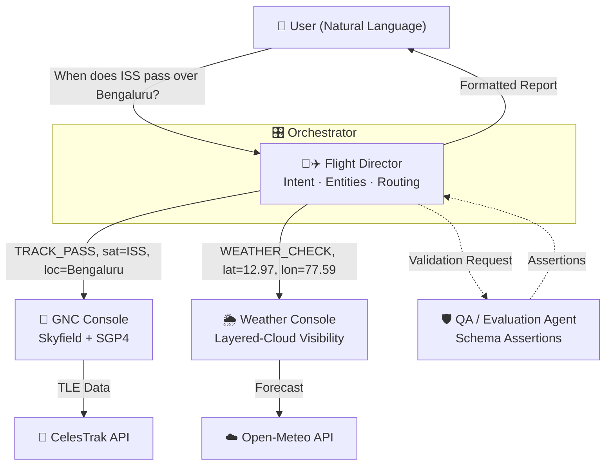

<div align="center">


# 🛰️ Space Operations Co-Pilot (SATCOM-CoPilot)

**An autonomous multi-agent orchestration system that makes LLM hallucination architecturally impossible in aerospace data.**

*Kaggle 5-Day AI Agents Intensive — Vibe Coding Capstone Project*

[](https://www.python.org/)
[](https://rhodesmill.org/skyfield/)
[](https://docs.pydantic.dev/)
[-brightgreen)](https://behave.readthedocs.io/)
[](LICENSE)

[The Problem](#-the-problem) · [The Solution](#-the-solution) · [Architecture](#%EF%B8%8F-architecture) · [Quick Start](#-quick-start) · [Kaggle Criteria](#-kaggle-capstone-criteria) · [Testing](#-testing--evaluation)

</div>

---

## 🚨 The Problem

Large Language Models are brilliant conversationalists and **terrible physicists**.

Ask an LLM *"When does the ISS pass over Bengaluru tonight?"* and it will confidently produce an answer — with fabricated times, invented azimuths, and hallucinated elevations. It cannot run SGP4 orbital propagation in its head, but it will never tell you that. In aerospace, a hallucinated pass window isn't a typo — it's a missed observation, a wasted ground-station booking, a failed mission plan.

**The core insight of this project:** the fix isn't a better prompt. It's a better *architecture* — one where the LLM is never allowed to produce a number in the first place.

## 💡 The Solution

SATCOM-CoPilot is a **hierarchical multi-agent system** with a hard architectural wall between language and math:

> **The LLM parses. Deterministic engines compute. A QA agent audits. The LLM never invents a number.**

- 🗣️ **Natural language in** — *"When can I see Hubble from Mumbai this weekend?"*
- 🧭 **Intent routing** — the Flight Director extracts `{intent: TRACK_PASS, sat: HST, loc: Mumbai}`
- 🔢 **Deterministic math** — Skyfield/SGP4 propagation on live CelesTrak TLE data, cross-referenced against Open-Meteo cloud layers
- 🛡️ **Post-execution audit** — a QA agent validates every payload against Pydantic v2 schemas before the user sees it
- 🖥️ **Mission-control output** — Rich terminal telemetry + a live auto-refreshing Folium fleet map

## 🏗️ Architecture



### The Four Agents

| Agent | Call Sign | Responsibility | Key Constraint |
|---|---|---|---|
| 🧑✈️ **Flight Director** | Orchestrator | Parses natural language, extracts entities (satellite, location, time window), routes intents | **Never computes.** Delegation only. |
| 🚀 **GNC Console** | Worker | Pulls live TLEs from CelesTrak, runs SGP4 propagation via Skyfield, computes pass windows (azimuth/elevation/range) | **Never interprets language.** Deterministic math only — same TLE in, same pass out, every time. |
| 🌦️ **Weather & COMM Console** | Worker | Queries Open-Meteo hourly forecasts, applies the layered-cloud visibility algorithm: `max(low×1.0, mid×0.8, high×0.4)` | **Never guesses.** Real forecast data or explicit degradation (R-005). |
| 🛡️ **QA / Evaluation Agent** | Sentry | Post-execution audit: validates every payload against Pydantic v2 schemas, runs hallucination checks and rubric scoring | **Nothing reaches the user unaudited.** |

### The Anti-Hallucination Wall

The security model is structural, not prompt-based:

1. **Input validation at the perimeter** — `src/config/guardrails.py` rejects malformed coordinates and corrupted TLE checksums before any agent touches them.
2. **Hard domain separation** — the language-handling agent has *no computational tools*; the math agents have *no generative freedom*. Hallucinating a pass time is not "discouraged" — it is **impossible by construction**.
3. **Schema-enforced outputs** — every inter-agent payload conforms to Pydantic v2 models (`TLEData`, `PassWindow`, `WeatherReport`, `CloudLayers`, `ObserverLocation`). Out-of-range values are rejected, never rendered.
4. **Rule R-005: Graceful Degradation** — if Open-Meteo fails, the system does not crash and does not invent weather. It falls back to "assume clear sky," **logs a visible amber warning**, and clearly labels the result as degraded. The agent fails *honestly*.

The full guardrail constitution (**Rules R-001 → R-008**) lives in [`.agents/AGENTS.md`](.agents/AGENTS.md) and binds every agent in the system.

## 🎬 Demo

### Mission Control in Your Terminal

Built with **Typer** + **Rich** — pixel-art satellite boot logo, a go/no-go agent status poll, and color-coded live telemetry tables for azimuth, elevation, range, and pass windows.

### Live Fleet Tracking Map

<div align="center">

</div>

Ask to track a fleet and the agent generates a **dark-themed interactive Folium map**: one color-coded marker per satellite with live SGP4-computed sub-satellite coordinates, visibility footprint circles, dashed ground-track lines to the observer, auto-fitted viewport bounds, and a **20-second auto-refresh loop** that turns a static HTML export into a live tracking display.

### Example Queries

```text
🛰️  > When does the ISS pass over Bengaluru in the next 72 hours?
🛰️  > Will I actually be able to see Hubble from Mumbai tonight, or is it cloudy?
🛰️  > Show me a live map of ISS, Hubble, Tiangong, GOES 16 and LANDSAT 9
```

## 🚀 Quick Start

### Prerequisites

- **Python 3.11+**
- Internet connection (live TLE + weather data)
- No API keys required — CelesTrak and Open-Meteo are free, keyless public APIs

### Installation

```bash
# 1. Clone the repository
git clone https://github.com/Sadiqsyed-prog/SATCOM-CoPilot.git
cd SATCOM-CoPilot

# 2. Create and activate a virtual environment
python -m venv .venv
source .venv/bin/activate        # Windows: .venv\Scripts\activate

# 3. Install dependencies
pip install -r requirements.txt
```

### Run

```bash
# Launch the interactive mission console
python src/main.py
```

Defaults on boot: **ISS (ZARYA) — NORAD 25544**, observer at **Bengaluru, India (12.97°N, 77.59°E)**, **72-hour** prediction window. All overridable in plain English.

### Run the Test Suite

```bash
# 16 end-to-end BDD scenarios (Gherkin specs in features/)
behave

# Unit tests with deterministic frozen fixtures
pytest tests/
```

## 📁 Project Structure

```text
SATTELITE_Tracking/
├── .agents/                       # 🧩 Agent Skills & Global Rules
│   ├── AGENTS.md                  #   Guardrail constitution (R-001 → R-008)
│   └── skills/
│       ├── copilot-router-skill/      # Flight Director parsing instructions
│       ├── satellite-tracker-skill/   # GNC orbital mechanics instructions
│       ├── weather-validator-skill/   # Open-Meteo fallback rules
│       └── qa-evaluator-skill/        # Rubric scoring & hallucination checks
│
├── src/                           # 🚀 Core Application
│   ├── main.py                    #   Typer/Rich CLI entry point
│   ├── agents/                    #   The four autonomous agents
│   │   ├── orchestrator.py        #     Flight Director: intent routing
│   │   ├── space_mechanics.py     #     GNC Console: orbital calculations
│   │   ├── environmental.py       #     Weather Console: cloud-layer logic
│   │   └── qa_evaluator.py        #     Sentry: post-execution validation
│   ├── tools/                     #   Deterministic API clients & math
│   │   ├── tle_fetcher.py         #     NORAD TLEs from CelesTrak
│   │   ├── pass_calculator.py     #     Skyfield/SGP4 propagation
│   │   ├── weather_fetcher.py     #     Open-Meteo hourly forecasts
│   │   ├── visibility_classifier.py #   max(low×1, mid×0.8, high×0.4)
│   │   ├── geocoder.py            #     City name → Lat/Lon
│   │   └── map_generator.py       #     Folium maps w/ 20s auto-refresh
│   ├── models/                    #   Pydantic v2 schemas
│   └── config/                    #   Settings + input-validation guardrails
│
├── features/                      # 🧪 BDD Specs (Gherkin) — 16 scenarios
├── evaluations/                   # 📊 QA evaluation suite & rubrics
├── tests/                         # ✅ Unit tests + frozen JSON fixtures
├── de421.bsp                      # 🌍 NASA JPL ephemeris (sunlit checks)
├── behave.ini
├── pyproject.toml
└── requirements.txt
```

## 🏆 Kaggle Capstone Criteria

| Course Concept | How This Project Demonstrates It |
|---|---|
| **🤝 Multi-Agent System** | Four agents in a hierarchical Orchestrator/Worker pattern — Flight Director commanding GNC + Weather consoles, independently audited by a QA Sentry — with hard-walled, non-overlapping domains |
| **🧩 Agent Skills** | Four custom [`.agents/skills`](.agents/skills) configurations (copilot-router, satellite-tracker, weather-validator, qa-evaluator). Adding a new console = writing a new skill definition, not rewiring the orchestrator |
| **🛡️ Guardrails & Security** | [`AGENTS.md`](.agents/AGENTS.md) constitution (R-001 → R-008): perimeter input validation, the architectural anti-hallucination wall, R-005 graceful degradation, and Pydantic schema assertions on every payload |
| **⚡ Vibe Coding** | Built end-to-end through AI-assisted spec-driven development: Gherkin specs written first, agents and tools generated against them, and 16 BDD scenarios locking in behavior with deterministic frozen fixtures |

## 🧪 Testing & Evaluation

Quality is enforced through **Spec-Driven Development** — behavior was specified *before* implementation:

- **16 end-to-end Behave (Gherkin) scenarios** across three feature files:
  - `satellite_tracking.feature` — pass prediction correctness
  - `weather_validation.feature` — cloud-cover math and R-005 fallbacks
  - `error_handling.feature` — API timeouts and malformed input
- **Deterministic fixtures** — frozen TLE sets and canned weather JSON make orbital tests reproducible: same input, same pass windows, every run, forever.
- **QA evaluation suite** in [`evaluations/`](evaluations/) — rubric-based scoring the Sentry agent applies to live responses.
  👉 **[View our perfect 100% Kaggle Technical Validation Report](evaluations/reports/eval_report.md)** proving zero hallucinations.

```gherkin
Scenario: Weather API failure degrades gracefully
  Given the Open-Meteo API is unreachable
  When I request visibility for the next ISS pass over Bengaluru
  Then the system assumes clear sky
  And an amber degradation warning is displayed
  And the response is labeled as degraded data
```

## 🔧 Tech Stack

| Layer | Technology | Why |
|---|---|---|
| Orchestration | Flight Director agent + 4 custom `.agents/skills` | Declarative, extensible routing |
| Orbital physics | `skyfield`, `sgp4`, CelesTrak API, JPL `de421.bsp` | Deterministic pass computation + sunlit checks |
| Weather | Open-Meteo API + layered-cloud algorithm | Keyless, hourly, layer-resolved forecasts |
| Validation | Pydantic v2 schemas + QA agent | Structural integrity on every payload |
| CLI | Typer + Rich | Mission-control terminal experience |
| Visualization | Folium (Leaflet.js) | Live auto-refreshing fleet maps |
| Testing | Behave (BDD/Gherkin) + pytest | Spec-driven, reproducible verification |

## 📄 License

Apache License 2.0 — see [LICENSE](LICENSE).

---

<div align="center">

**Built for the Kaggle 5-Day AI Agents Intensive — Vibe Coding Capstone**

*The LLM parses. The engines compute. The Sentry audits. Nothing is invented.*

</div>
